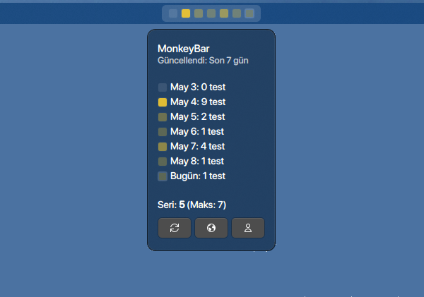

<div align="center">


# MonkeyBar Plasma

**A KDE Plasma 6 plasmoid for Monkeytype enthusiasts**

*Track your typing activity with elegant visual feedback right in your top bar*

[](LICENSE)
[](https://store.kde.org/p/2358701/)
[](https://github.com/AROICE-HQ/monkeybar)

[Features](#-features) • [Installation](#-installation) • [Configuration](#-configuration) • [Themes](#-themes) • [Credits](#-credits)



</div>

---

## Overview

**MonkeyBar Plasma** brings Monkeytype activity into the KDE Plasma panel as a lightweight plasmoid. It keeps the core MonkeyBar vibe, adapts the UI for Plasma 6, and stays focused on quick glanceable typing stats without getting in the way.

This project is **vibe coded** and intentionally practical: it borrows the idea and spirit of the original MonkeyBar project by **AROICE**, while reworking the experience for KDE Plasma.

## Features

- **Compact panel widget** for KDE Plasma 6
- **Monkeytype activity display** with daily test counts
- **Streak and max streak** visibility
- **Two color modes**: opacity-based and grade-based
- **12 built-in themes** for a variety of desktop styles
- **Current day highlight** with subtle borders
- **Configurable week start day**
- **Optional current week view**
- **Flexible placement** inside the Plasma panel
- **Right-click actions** for quick access

### Display Modes

#### Opacity Mode

Activity intensity is represented through transparency. Empty days stay subtle, while active days become more visible.

#### Grade Mode

Daily activity is mapped into color grades based on test count thresholds.

## Installation

### From Source

```bash
git clone https://github.com/TaylanTatli/monkeybar-plasma.git
cd monkeybar-plasma
./install.sh
```

If your environment does not use the installer script, you can also place the plasmoid in your local Plasma widget directory and restart Plasma Shell.

### Requirements

- **KDE Plasma 6**
- **Qt / QML support** provided by Plasma
- **Internet connection** for Monkeytype API access
- **Monkeytype account** for personal activity data

## Configuration

After installing the plasmoid, open its settings to configure:

- **Monkeytype username**
- **ApeKey**, if you want authenticated activity data
- **Theme selection**
- **Color mode**
- **Days to show**
- **Week start day**
- **Current week only** toggle
- **Current day highlight** toggle

## Themes

MonkeyBar Plasma includes 12 themes:

- Standard
- GitHub Dark
- Halloween
- Teal
- Left Pad
- Dracula
- Blue
- Panda
- Sunny
- Pink
- Solarized Dark
- Solarized Light

## Credits

This project is based on the original [MonkeyBar](https://github.com/AROICE-HQ/monkeybar) by **AROICE / Aryan Techie**.

The Plasma adaptation, UI changes, and KDE-specific integration were created for this repository while keeping the original idea and attribution intact.

## License

This project is licensed under the [MIT License](LICENSE).

Please keep the original attribution when redistributing or modifying this work.

## Notes

- This is a KDE Plasma adaptation, not the original GNOME Shell extension.
- The codebase is intentionally small and focused on the plasmoid experience.
- If you build on top of it, keep the AROICE attribution visible in the project history and documentation.
